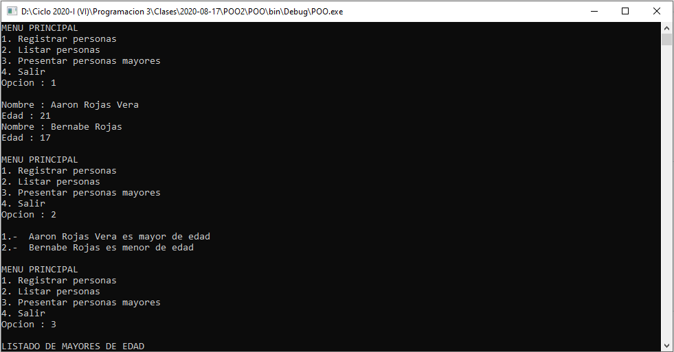

# Control de personas
Sistema de control de personas que permite ingresar los datos de una persona, mostrar los datos registrados y mostrar las personas mayores de edad, **17/08/20**.

<strong>Imagen:</strong> Menú principal - Registrar personas.

